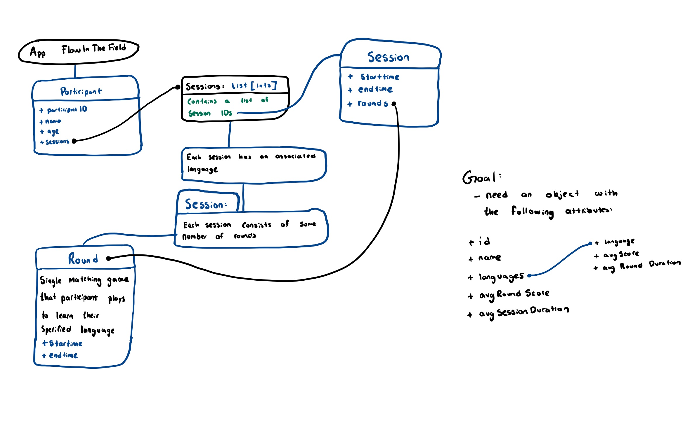

# sandbox-spring26-caterpillar-solution
by aarish kodnaney

solution for submission for the sandbox spring 2026 application cycle caterpillar challenge. written without the assistance of genAI.

view on github: (https://github.com/AarishKod/sandbox-spring26-caterpillar-solution)

## How to run this solution
this solution is written in python. In this repo/zip file, you can view the output, which is written to output.json by the python script. Alternatively, you can run it locally by navigating to main.py and executing it. Finally, the **best option** is to run the code via Github Actions (I've already set up a YAML file) where you can see the terminal output and json preview. Just head to this: [Github Actions](https://github.com/AarishKod/sandbox-spring26-caterpillar-solution/actions/runs/20352449203/attempts/3). To re-run the code in real time, select the re-run all jobs button located at the top right.

## My thought process / solution design
when I first read over the challenge, my only thought was "whoa, this is going to be a lot of for loops." After that, however, I went and got a grasp of the app by drawing out how things interact with each other, and then started planning out what files and classes I would need via a kinda-sorta UML-diagram ish drawing.

    

## Primary technical problems
this challenge was kind of a combination of what we've done over the semester in PD1 (program and design implementation 1). Because of this, I didn't really have an issue writing the actual code. For me, the harder part was coming up with an architecture to build this solution using the best design principles. While my program design definitely is not the best, I'm still pretty proud of the architecture I came up with and the way all the classes and files interact with each other. A key weakness however, is how reliant the methods in stats.py are on each other. If I had more time, this is definitely something I would work to improve. Beyond that, my primary technical issue was actually getting the code to run in Github Actions. I used Github Actions to make it easy for a reviewer to run my code, as they can run the code directly in a browser using it. I'd never used this technology before, so I had to learn how to write a YAML file and set up a workflow.

## Approx time for completion
took roughly 7 hours
